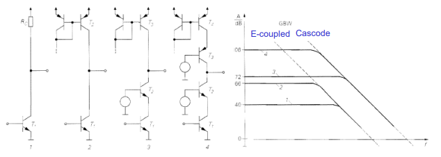
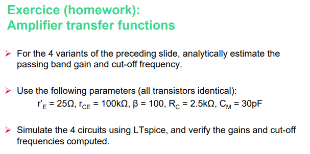
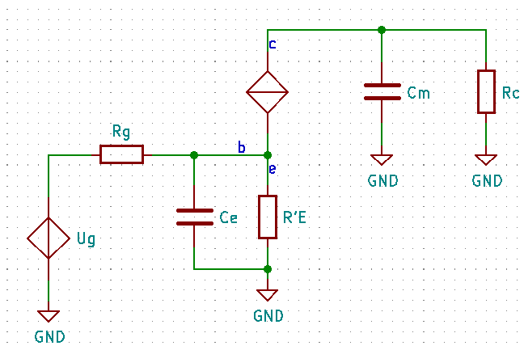

# Exercice 1 (P. 17)

  

  

$$R'_E=25\Omega\qquad r_{CE}=100k\Omega\qquad \beta=100\qquad R_C=2.5k\Omega\qquad C_M=30pF$$

## Premier montage

  

### Gain

$$g_m=\frac{1}{R'_E}$$

La tension de sortie est sur $R_C$ (quelle que sois la référence)
$$A=\frac{R_C}{R'_E}$$

### Bande passante

$$C_e=C_m\cdot (1+A)$$
Comme $C_m \ll C_e$ on le néglige

On applique la formule

$$\LARGE \frac{1}{2\pi \beta R'_E A C_m}\approx \frac{1}{2\pi \frac{R'_E\cdot R_g}{R'_E+R_g} C_e}$$

